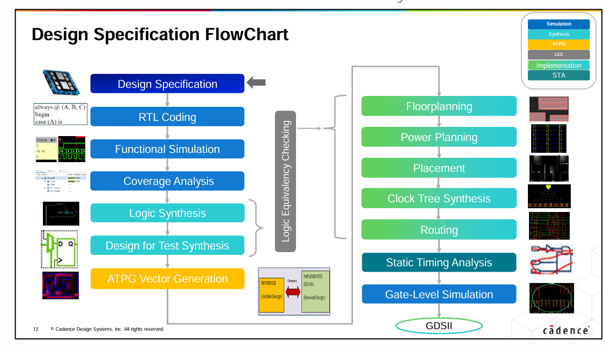
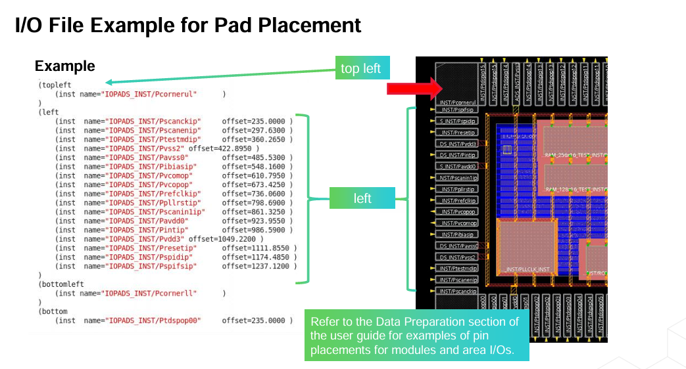
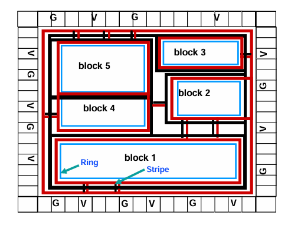
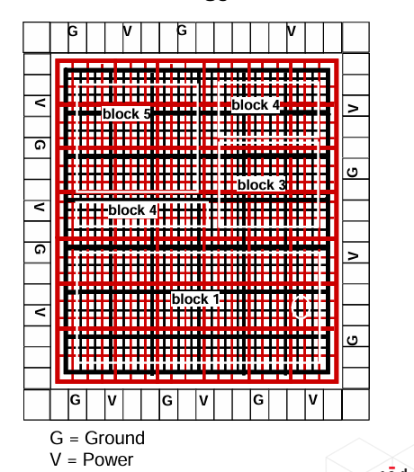
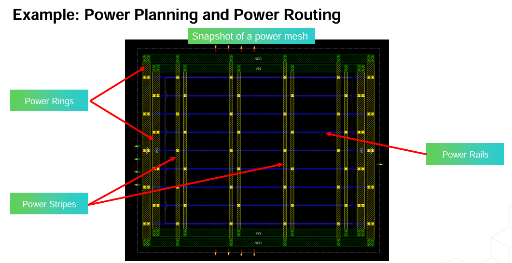
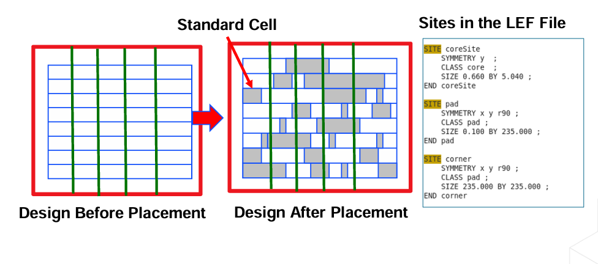
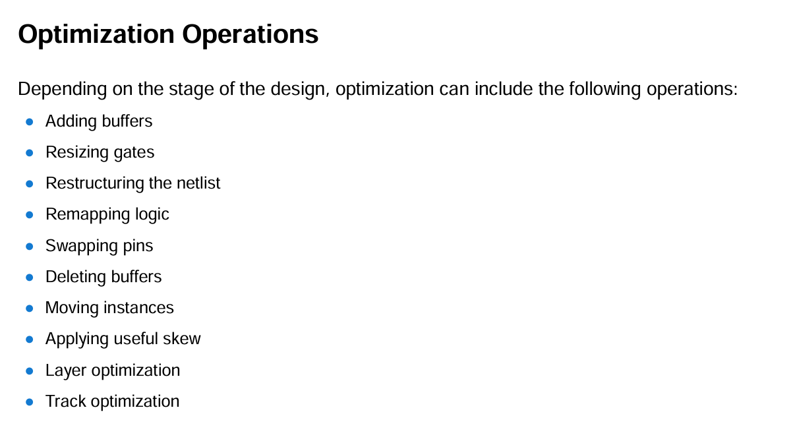
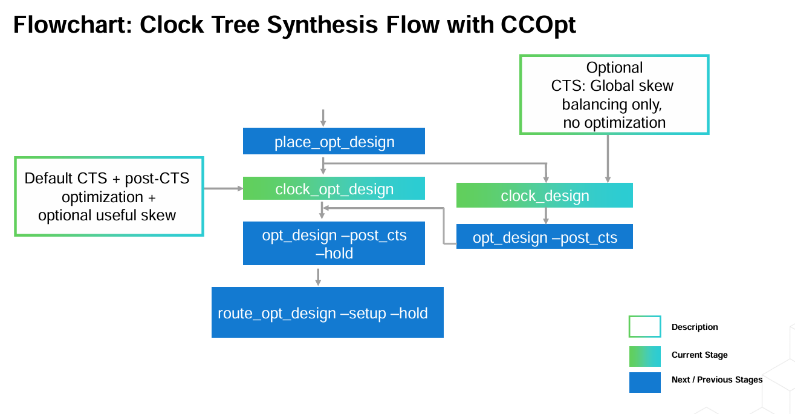
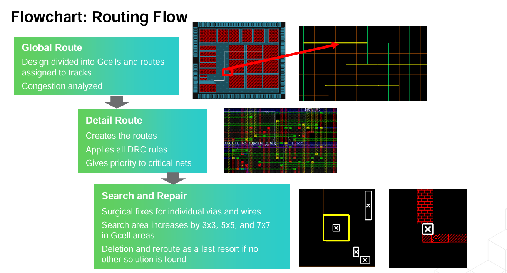

> Design Specificifications is an explicit set of requirements  to be satisfied by a product or service.
> HDL is a programming language for modelling hardware logic. behavioral(algorithms), data flow(Register transfer level RTL) or gate level (built in primitives)

> RTL Coding - Converting design spec to high level design using HDL. describe how data moves between registers and comb logic. explicitly efines register behavior so logic synthesizers can generate actual hardware from it.

> Design Verification verifies the RTL Design functionality, logic, quality. - verify syntax, functionality, logical behavioral, timing violations, power issues, improve performance, efficiency and reliability.

# Cadence Xcelium Simulator
> xrun filename.v(s) - +
does compilation(check syntax, create design objects like AST or verilog syntax tree, invoke appropriate compiler for each file), elaboration(xmelab - constructs design hierarchy and connects signals-generates a snapshot) and simulation(xmsim - execute simulation)

# Digital Implementation 
It is the process of importing a gate-level netlist as well as the technology libraries & generating a physical design that meets PPA
**Input files** - Netlist.v, design_constraints.sdc, timing_library_logical_info.lib,physical_layout_library.lef, drc_rules_tech.lef(tech file), rc.qrtech.

## Floorplanning 
It is the process of deriving die size, allocate space for soft blocks, power planning, macro placement.
create_floorplan or gui for die/core area, utilization, aspect, core to i/o boundary
### Pads and Pins
Are assigned by reading in I/O assignment file or def file. refer for i/o file 

## Power Planning
> Designing PDN supplies power and ground nets to all instances, sizing wires, choosing metal layers.
1. Rings and stripes methaodology. 
2. Power Mesh methodology. 
### Power Routing
Connecting local power routes to global power routes that are created during power planning. 
> Power rings, Power stripes and Power Rails

## Scan Chains -scandef file
A chain of FFs acts as shift registers used for controllability and observability. [Functional mode or Scan mode]
> Scan Reordering is reordering scan chains to save routing resources
> Scan Insertion is done during synthesis and reorder in Implementation
> Tool identifies the scan cells , if not use set_scan_cell command to manually define their behavior
> If scandef file in not available, use create_scan_chain command to manually create one.

## Placement
> Placing the standard cells and blocks(macros, ip etc.,) in floorplanned design according to LEF file. 
🟦 Each SITE is a single tile.

➖ A ROW is a line of tiles placed side by side.

⬛ Standard cells are placed on top of these tiles.

## Optimization
> Process of iterating through a design to meet timing, area and power. 
> General optimizations - Timing, Signal Integrity, Area, Power.
Ex: Adding/deleting Bufffers, resizing gates, restructuring netlist, remapping logic, swapping pins, layer/track optimization.
Interleaved Placement and Optimization - both happen in parallel. while placing cell , tool checks for drc, congestion estimate, IR drop and optimize logic

## clock Tree synthesis
> Process of inserting buffers in the clock path to minimize clock skew and latency to optimize timing.
>  Automatically generating cts spec file (inputs are sdc files, v, def, libraries) create_clock_tree_spec [-help] [{-out_file <filename>} ][ -views <analysis_view>+] [ -out_file<filename> ]

flowchart - 

## Routing
Detail routing is connecting cells and macros in the design on metal layers specified in tech lef file provided by foundry so routes are drc correct, timing aware and SI aware.
global-detail-search and repair :  
### Timing and SI driven routing  
> set nano route modes for timing and SI driven routing to produce routes with best QoR.
 set_db route_with_timing_driven true # tcl commands
 set_db route_with_si_driven true
 route_design
 To route selected nets, run the command:
 route_design-selected 

> Adding filler cells to fill gaps between standard cell instances to provide continuity for power and ground rails. add_fillers

## rc extraction- spef file

## Power analysis and rail analysis(IR drop analysis)
